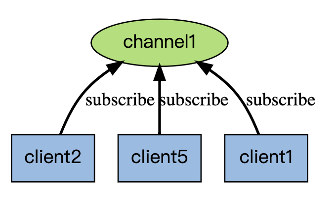
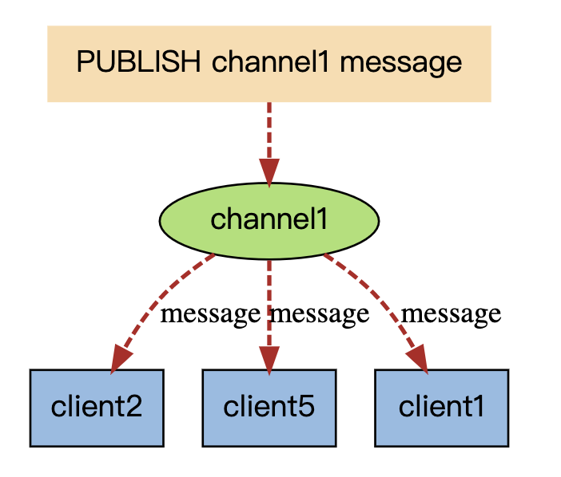
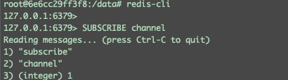
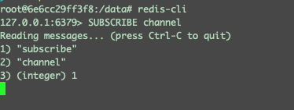
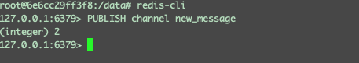
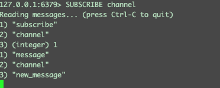
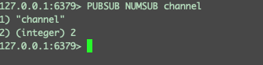
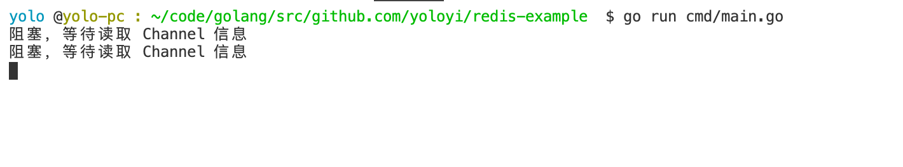
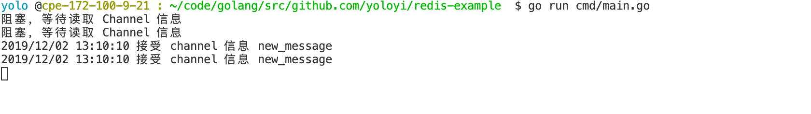
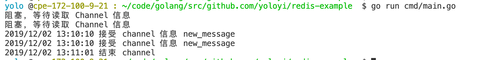

# 如何在 Golang 中使用 Redis 订阅/发布
> 订阅，取消订阅和发布实现了发布/订阅消息范式(引自wikipedia)，发送者（发布者）不是计划发送消息给特定的接收者（订阅者）。而是发布的消息分到不同的频道，不需要知道什么样的订阅者订阅。订阅者对一个或多个频道感兴趣，只需接收感兴趣的消息，不需要知道什么样的发布者发布的。这种发布者和订阅者的解耦合可以带来更大的扩展性和更加动态的网络拓扑。


## 什么是 Redis 订阅发布？

Redis 的 订阅(SUBSCRIBE) 可以让客户端订阅任意数量的频道， 每当有新信息发送到被订阅的频道时， 信息就会被发送给所有订阅指定频道的客户端。

如图例子

**订阅：**

举个例子，假设 客户端 A、B、C 订阅了一个 channel 通道。那么他讲阻塞 等待接收信息。等到有一个新的消息 往 channel 里面发送数据。那么通道将会 通知给客户端 A、B、C

**发布：**


**redis-client 实验订阅发布**

1、首先开启 Redis

2、打开三个 redis-cli 窗口





我们可以看到当你订阅后，会阻塞在这里，等待新信息

3、在新的redis-cli 窗口 PUBLISH 一个新的信息 Channel 信息



4、切换窗口，我们可以看到另外两个订阅的窗口接受到了一条 channel 信息



**查看订阅者的总数**

这里有两个窗口订阅了消息，所以就有 2



## 订阅发布适合什么场景？
订阅发布的好处是，订阅接受的信息只会发送给订阅者。

假设我有一个系统，我有 a，b 两个订阅的通道。
我在某个服务中，只需要订阅 a 信息，那么用 Redis 的订阅 / 发布，订阅者只会接受到他需要接受的订阅信息。

>简单的应用场景的话, 以门户网站为例, 当编辑更新了某推荐板块的内容后:
CMS发布清除缓存的消息到channel (推送者推送消息)
门户网站的缓存系统通过channel收到清除缓存的消息 (订阅者收到消息)，更新了推荐板块的缓存。

下面我会用列子来解释，我如何在 Golang 中使用订阅发布来关闭某些服务

## 在 Golang 中使用订阅发布

1、 下载 go redis 库
`go get -u github.com/go-redis/redis`

2、链接Redis 并且 订阅 wait-close服务
```golang
package main

import (
	"fmt"
	"log"
	"sync"

	example "github.com/yoloyi/redis-example"
)

func main() {
	var wg sync.WaitGroup
    // 这里我们用携程来模拟多个服务
	for i := 0; i < 2; i++ {
		wg.Add(1)
		go func(i int) {
            
			client := example.InitRedis()

			pb := client.Subscribe("wait-close")
			fmt.Println("阻塞，等待读取 Channel 信息")
			for {
				select {
                case mg := <-pb.Channel():
                // 等待从 channel 中发布 close 关闭服务
					if mg.Payload == "close" {
                        // 当
						wg.Done()
					} else {
						log.Println("接channel信息", mg.Payload)
					}
				default:
				}
			}
		}(i)
	}

	wg.Wait()
	log.Println("结束 channel")
}
```

3、打开服务



4、从 redis-cli 或者其他客户端发布信息

`PUBLISH  wait-close new_message`





5、当我们发布了 close 给某个通道，我们可以看到 两个订阅都被关闭了。

`PUBLISH  wait-close close`





## 结尾

这里的例子，用了两个协程来做两个服务，实际的应用场景中，我们在分布式系统中，每一个服务里面都会订阅这样一个类似的通道，比如更新 LocalCache。当用户在前台修改了某个值，我们需要去更新你服务里面保存的一些值，就可以通过这种方式去触发到不同的机器。来更新一些缓存啊，或者是一些其他信息。

有一些其他类似的队列，比如 ActiveMQ 也提供了类似的 发布 / 订阅 的功能，但是在 ActiveMQ 要远比 Redis更复杂，因为 Redis 是一个 Cache，毕竟Redis不是专门做发布订阅的。但是如果系统中已经有了Redis，并且需要基本的发布订阅功能，就没有必要再安装ActiveMQ了，

具体选型，看你领导。

## 参考文献

* [Redis](http://redis.cn/topics/pubsub.html)

* [订阅与发布](https://redisbook.readthedocs.io/en/latest/feature/pubsub.html)


